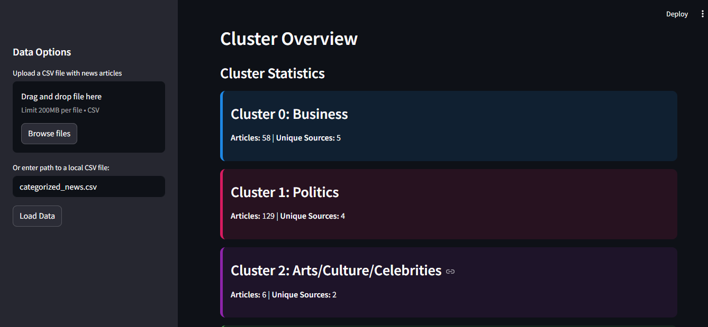
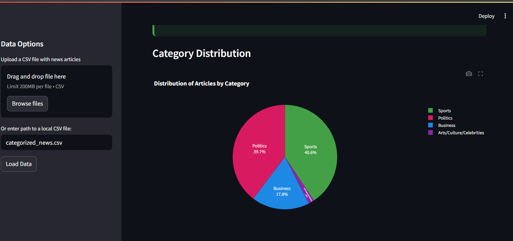
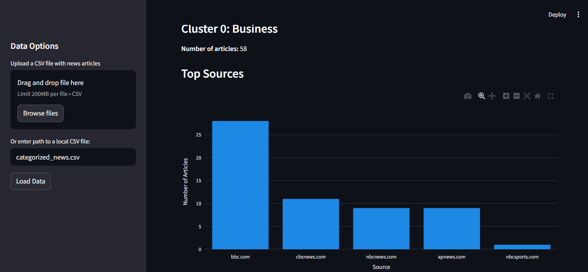
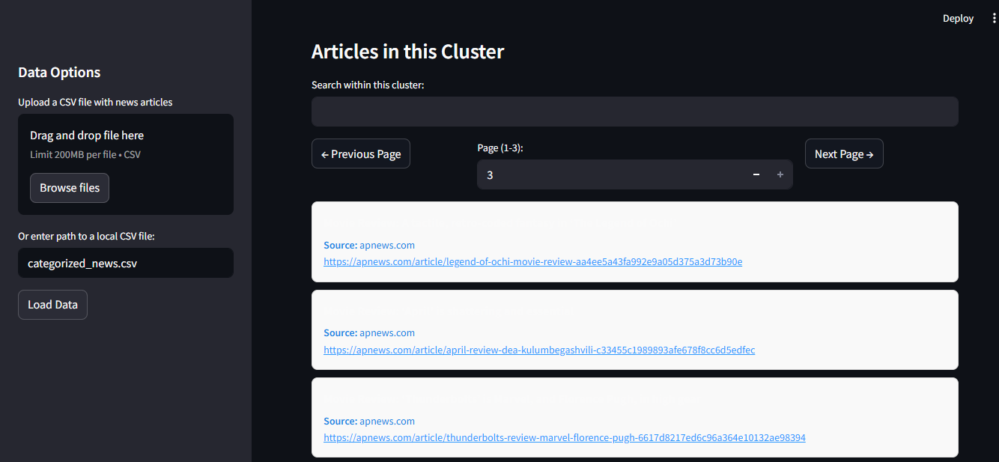

### How to install the app

**1. Create  a virtual enviroment**

`python -m  venv venv`

**2. Activate a virtual enviroment**
   
   **Windows:**
   
   `.\venv\scripts\activate`

  **Linux:**
   
   `source/venv/bin/activate`

**3. Install requirements**

`pip install -r requirements.txt`

**4. Run the app**
 `streamlit run app.py`

 ### Results of the App

